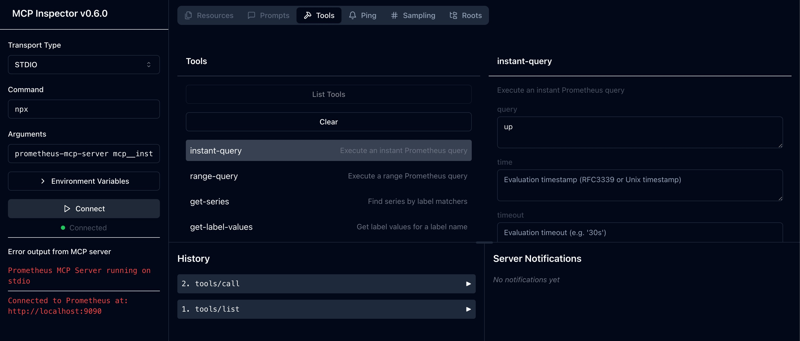

# prometheus-mcp-server



A Model Context Protocol (MCP) server for interacting with Prometheus metrics and data.

This is a TypeScript-based MCP server that implements a Prometheus API interface. It provides a bridge between Claude and your Prometheus server through the Model Context Protocol (MCP).

## Features

- **Instant Queries**: Execute PromQL queries at a specific time
- **Range Queries**: Execute PromQL queries over a time period
- **Series Discovery**: Find series by label matchers
- **Label Exploration**: Get label names and values
- **Metadata Access**: Get metadata for metrics
- **Target Information**: Get information about scrape targets
- **Alerts & Rules**: Get information about alerts and recording rules
- **Status Information**: Get Prometheus server status information

## Installation

```bash
# Install globally
npm install -g prometheus-mcp-server

# Or install locally
npm install prometheus-mcp-server

# Or use npx to run without installation
npx prometheus-mcp-server
```

## Usage with Claude

To use with Claude Desktop, add the server config:

**On MacOS**: `~/Library/Application Support/Claude/claude_desktop_config.json`
**On Windows**: `%APPDATA%/Claude/claude_desktop_config.json`

```json
{
  "mcpServers": {
    "prometheus-mcp-server": {
      "command": "/path/to/prometheus-mcp-server/build/index.js",
      "env": {
        "PROMETHEUS_HOST": "http://your-prometheus-instance:9090"
      }
    }
  }
}
```

### Using with npx

You can also use npx in your Claude Desktop configuration:

```json
{
  "mcpServers": {
    "prometheus-mcp-server": {
      "command": "npx prometheus-mcp-server",
      "env": {
        "PROMETHEUS_HOST": "http://your-prometheus-instance:9090"
      }
    }
  }
}
```

## Configuration

The server requires the following environment variable:

- `PROMETHEUS_HOST`: The base URL of your Prometheus instance (default: `http://localhost:9090`)

## Available Functions

The server provides the following functions:

- `mcp__instant_query`: Execute an instant PromQL query
- `mcp__range_query`: Execute a range PromQL query over a time period
- `mcp__get_series`: Find series by label matchers
- `mcp__get_label_values`: Get values for a specific label
- `mcp__get_metadata`: Get metadata for metrics
- `mcp__get_targets`: Get information about scrape targets
- `mcp__get_alerts`: Get information about alerts
- `mcp__get_rules`: Get information about recording and alerting rules
- `mcp__get_status`: Get status information about the Prometheus server

## Development

```bash
# Install dependencies
npm install

# Build the project
npm run build

# Start the server
npm start

# Debug
npm run dev:debug
```

## Debugging

Since MCP servers communicate over stdio, debugging can be challenging. You can use the following npm scripts for debugging:

```bash
# Inspect mode
npm run inspect

# Inspect with breakpoints
npm run inspect-debug
```

## License

ISC

## Contributing

Contributions are welcome! Please feel free to submit a Pull Request.